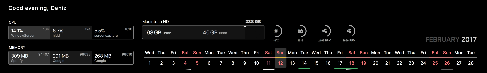

horizontal-calendar-widget
==========================

A simple [Übersicht](http://tracesof.net/uebersicht/) Widget. This will enable a sleek Dateline-like horizontal calendar on your desktop to make it more useful.

## Screenshot

## Extra Functions

##### ClearOutside
This page has ratings of weather for cloud coverage (a must for stargazers) over every hour.

`Green flashing lines represent open skies for the week ahead`

##### Time&Date
This page has lots of information about time, date, year... 😄 It has information about moon phases too.

Colors and their meanings has been listed bellow

Color | Moon Phase
--- | ---
black-white | First Quater
white | Full Moon
white-black | Third Quater
black | New Moon

## Download

To download just the zipped widget folder, check out [the latest release](https://github.com/ashikahmad/horizontal-calendar-widget/releases/latest).

## Contributing

Have an idea for improving this widget? [Open an issue](https://github.com/ashikahmad/horizontal-calendar-widget/issues/new) or fork this repository and send a pull request :grinning:.

If you want to contribute, having a go at one of these items above might be a good place to start! :+1:

## License

[CC0 1.0 Universal](./LICENSE)
